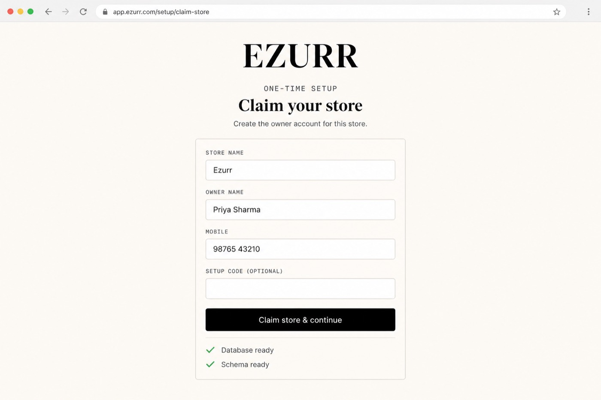
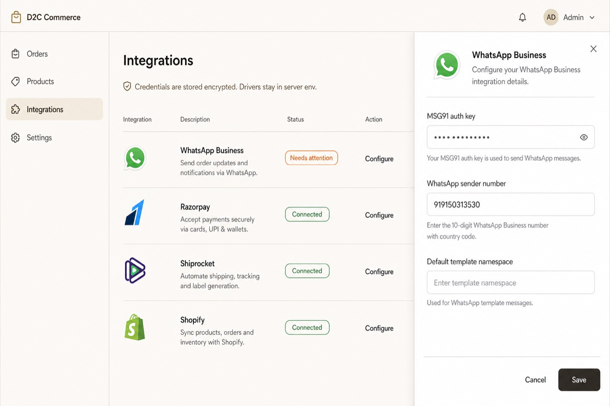
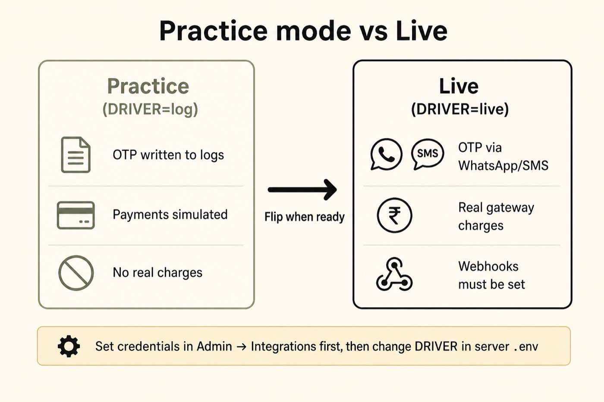

# Deploy Ezurr (human guide)

This walks you from an empty server to a store you can claim, configure, and
take live. Screens below are **illustrative** — your exact theme may differ
slightly, but the steps match.

You deploy **two apps on two hosts** — and they have **two separate installers**:

| Host | Repo | Typical host | Installer |
|------|------|----------------|-----------|
| JSON API | `ezurr-api` (Laravel) | Cloudways / VPS | `php artisan ezurr:install` → open `https://api…/install` |
| Storefront + Admin UI | `ezurr-theme` (Next.js) | Vercel | Claim only at `https://www…/setup` after the API console is green |

Do **not** treat Vercel `/setup` as “install the whole app.” It only claims the owner after the API host is already prepared.

```
  Shoppers & staff  →  https://www.yourstore.com   (Next)
                              │
                              │  /api/*  (same-origin proxy, recommended)
                              ▼
                        https://api.yourdomain.com  (Laravel)
                              │
                              ▼
                           MySQL / Postgres
```

### Two-installer checklist (order matters)

1. **API (Cloudways / Laravel)** — web root → Laravel `public/` → env → `php artisan ezurr:install` → open `https://api…/install` until green (`/api/health` JSON, not a “PHP Stack” HTML page).
2. **Theme (Vercel)** — set `NEXT_PUBLIC_API_URL` to the API origin **with no `/api` suffix** → deploy succeeds → confirm `https://www…/api/health` returns JSON via the proxy.
3. **Claim** — open storefront `/setup` only after step 1 is green. Home redirects there when the API reports unclaimed.

---

## Before you start

Have these ready:

1. A database (MySQL/MariaDB on Cloudways, or Neon Postgres, etc.)
2. Two domains or subdomains (example: `www.yourstore.com` + `api.yourdomain.com`)
3. Access to both repos and your hosting dashboards
4. About 30–45 minutes for a first deploy

**Golden rules**

- Generate `APP_KEY` **once** and never rotate it casually — it decrypts
  integration secrets stored in the database.
- Keep payment/messaging drivers on `log` (practice) until credentials and
  webhooks are set. Practice mode looks successful but does not charge or SMS.
- Run a **queue worker** and a **scheduler** in production. Without the worker,
  login OTPs never leave the queue.

---

## Step 1 — Create the database

1. Create an empty database in your host’s panel (or a Neon project).
2. Copy the host, name, user, and password (or the full `DB_URL`).

You do not need to create tables by hand — the install command does that.

---

## Step 2 — Deploy the API (`ezurr-api`)

### 2a. Environment

Copy [`.env.production.example`](../../ezurr-api/.env.production.example) into the host’s
real `.env` (never commit the filled file).

Minimum values to fill:

| Variable | Example | Notes |
|----------|---------|--------|
| `APP_ENV` | `production` | Required — boot refuses `local` behind a public URL |
| `APP_DEBUG` | `false` | |
| `APP_KEY` | `base64:…` | From `php artisan key:generate --show` — **keep forever** |
| `APP_URL` | `https://api.yourdomain.com` | No trailing slash |
| `THEME_URL` | `https://www.yourstore.com` | Storefront origin |
| `CORS_ORIGINS` | `https://www.yourstore.com` | Same origin(s), comma-separated, no trailing slash |
| `DB_CONNECTION` | `mysql` / `pgsql` / `mariadb` | Must be set explicitly |
| `DB_*` or `DB_URL` | … | From Step 1 |
| `QUEUE_CONNECTION` | `database` | Do **not** use `sync` in production |

Drivers can stay on practice for first boot:

```env
RAZORPAY_DRIVER=log
MSG91_DRIVER=log
CASHFREE_DRIVER=log
SHIPROCKET_DRIVER=log
SHOPIFY_DRIVER=log
SERVER_ANALYTICS_DRIVER=log
```

**Keys, secrets, WhatsApp number, shop domain, etc. are entered later in
Admin → Integrations** — not in `.env`. Only drivers (and base URLs) stay in env.

### 2b. Install code & prepare the database

**Preferred:** open **`https://your-api-host/ezurr-install.php`** (web root must
be Laravel `public/`). Fill DB, URLs, and owner fields — it writes `.env`,
migrates, creates the owner, starts a queue worker, and prints the cron line.
Then set Vercel `NEXT_PUBLIC_API_URL` and sign in at storefront `/auth`.

See `ezurr-api/deploy/README.md`. SSH alternative: `bash deploy/hosting-deploy.sh`
or `php artisan ezurr:bootstrap --store=… --name=… --mobile=… --start-worker`.

### 2c. Processes (do not skip)

Start **three** processes (see `Procfile` or `deploy/*.service`):

| Process | Command | Why |
|---------|---------|-----|
| Web | `php artisan serve` / nginx+php-fpm / Octane | Serves `/api/*` |
| Worker | `php artisan queue:work --queue=otp,default,shopify` | OTPs, messages, Shopify jobs |
| Scheduler | `php artisan schedule:work` (or cron `schedule:run`) | Abandoned-cart, periodic tasks |

Smoke-test:

```bash
curl -sS https://api.yourdomain.com/api/health
# then open in a browser:
# https://api.yourdomain.com/install
```

You want healthy JSON from `/api/health` and a green **Backend install** console
at `/install` — not an HTML “PHP Stack” / default host page. If you see HTML,
the web root is wrong (point it at Laravel’s `public/`).

The `/install` console is API-only. It does not create the owner. Finish it
before deploying or claiming on Vercel.

---

## Step 3 — Deploy the storefront (`ezurr-theme`)

In Vercel (or your Next host), set:

| Variable | Example | Notes |
|----------|---------|--------|
| `NEXT_PUBLIC_API_URL` | `https://api.yourdomain.com` | Upstream Laravel origin — **no `/api` suffix** |
| `NEXT_PUBLIC_API_PROXY` | `1` | Production **defaults on** when `NEXT_PUBLIC_API_URL` is set |

In production, the browser already uses same-origin `/api/*` unless you set
`NEXT_PUBLIC_API_PROXY=0` (direct/CORS mode). Next still rewrites `/api/*` to
Laravel when the API URL is set. Keep `CORS_ORIGINS` matching the storefront
origin (RSC / server calls and any direct clients still need it).

Deploy the theme, then confirm the proxy:

```bash
curl -sS https://www.yourstore.com/api/health
```

If that 404s or returns HTML, the theme build/env is wrong — fix it before `/setup`.

### Browser API discovery (when the proxy looks dead)

Production **still requires** `NEXT_PUBLIC_API_URL` at build time (rewrites + RSC).
The browser can still recover without a rebuild:

1. Same-origin probe — home / `/setup` try `GET /api/health` on the storefront.
   If the JSON includes `"service":"ezurr-api"`, the proxy is working and no paste is needed.
2. Paste override — if that fails, paste the Laravel origin (no `/api` suffix).
   It is stored in this browser only (`localStorage`) and uses direct CORS.
   The API must already list the storefront in `CORS_ORIGINS` / `THEME_URL`.
3. Use **Forget saved API URL** when the env/proxy path is fixed.

Do not rely on paste for every visitor — set the Vercel env and redeploy for a durable fix.

---

## Step 4 — Claim the store (`/setup`)

A fresh install has **no owner**. After the API `/install` console is green, the
storefront home page sends you to `/setup` (frontend claim wizard only).



*Illustrative. Your form may include a setup-code field if you ran `--claim-token`.*

1. Open `https://www.yourstore.com/setup` (or follow the redirect from `/`).
2. Confirm the green checks: database + schema ready.
3. Enter store name, your name, and the **mobile number you will use to sign in**.
4. If you generated a claim token, enter that setup code.
5. Click **Create my owner account**.

You are signed in as owner immediately (OTP is not used for claim — messaging
may still be in practice mode).

After claim, `/setup` closes for good. Later sign-ins use OTP on `/auth`.

---

## Step 5 — Configure integrations (Admin)

Open **Admin → Integrations**.



*Illustrative. Configure each provider you need; leave the rest disconnected.*

For each provider you use, click **Manage** and paste real values:

| Integration | Typical fields |
|-------------|----------------|
| WhatsApp Business | MSG91 auth key, sender number, namespace, OTP SMS template, DLR secret *(this sender number is not the storefront chat number on Settings → Store)* |
| Razorpay / Cashfree | Key / app id, secret, webhook signing secret |
| Shiprocket | Panel email + password, tracking webhook token |
| Shopify | Access token, `*.myshopify.com` domain, webhook secret |
| Google Analytics | GA4 Measurement Protocol secret + Meta CAPI token *(public measurement / pixel IDs live under Settings → Store)* |

Secrets are stored **encrypted** in the database (using `APP_KEY`).

Then register provider webhooks to your API (examples):

| Provider | URL |
|----------|-----|
| Razorpay | `https://api.yourdomain.com/api/webhooks/razorpay` |
| Cashfree | `https://api.yourdomain.com/api/webhooks/cashfree` |
| MSG91 DLR | `https://api.yourdomain.com/api/webhooks/msg91?token=YOUR_DLR_SECRET` |
| Shiprocket | `https://api.yourdomain.com/api/webhooks/shiprocket` (token as `x-api-key`) |
| Shopify | `https://api.yourdomain.com/api/webhooks/shopify` |

Use **Test connection** on each row after saving. A result of *simulated* means
the driver is still `log` — expected until Step 6.

Also set store basics under **Settings → Store** (name, GA measurement id, Meta
pixel id, etc.).

---

## Step 6 — Flip practice → live



Credentials live in Admin. **Drivers stay in the API `.env`.**

When WhatsApp templates are Meta-approved, payment webhooks are registered, and
a test order looks right in practice mode:

1. Edit API env, for example:
   ```env
   MSG91_DRIVER=live
   RAZORPAY_DRIVER=live
   ```
2. Redeploy / reload config: `php artisan config:cache`
3. Confirm the queue worker is running
4. Send a real OTP to your phone and place a small live prepaid order

Until messaging is `live`, production OTP send is refused (you will not get a
silent “success” with no SMS).

---

## Step 7 — Smoke checklist

Work through this once after go-live:

- [ ] `GET /api/health` on the API (and `/api/health` on the storefront if proxied)
- [ ] Unclaimed → claimed: `/setup` no longer available
- [ ] Owner can open Admin
- [ ] OTP sign-in works on a real handset (`MSG91_DRIVER=live` + worker)
- [ ] Catalog loads on the storefront
- [ ] COD and/or prepaid checkout completes
- [ ] Prepaid webhook marks the order paid (not only the browser sheet)
- [ ] Admin → System / health shows expected drivers
- [ ] Backup plan exists — see [ops-backup.md](../../ezurr-api/docs/ops-backup.md)

---

## Common snags

| Symptom | Likely cause | Fix |
|---------|--------------|-----|
| Setup says database not ready | Bad `DB_*` / firewall | Fix env; re-run `ezurr:install` |
| Claim asks for a setup code you do not have | `--claim-token` was used | Re-run install with a new token, or clear the hash from install state (ops only) |
| OTP never arrives | Worker down, or `MSG91_DRIVER=log` | Start worker; set credentials in Integrations; flip driver to `live` |
| “Practice mode” payments | `RAZORPAY_DRIVER=log` | Expected until you flip live |
| CORS / network errors in browser | Proxy off + missing CORS | Prefer `NEXT_PUBLIC_API_PROXY=1`; keep `CORS_ORIGINS` exact |
| Integrations secrets unreadable after deploy | `APP_KEY` changed | Restore the original key from your secret store |
| Jobs “succeed” but nothing external happens | Driver still `log` | Flip the matching `*_DRIVER` after credentials are set |

---

## Updating an existing store

Two consoles on the API host:

| URL | When |
|-----|------|
| `https://api…/install` | First prepare (unclaimed) |
| `https://api…/update` | After each API code deploy (status + CLI) |

```bash
# 1. Deploy new Laravel code to the API host
# 2. Open https://api.yourdomain.com/update — confirm it says “Update needed”
# 3. On the API host:
php artisan ezurr:update
# unattended:
# php artisan ezurr:update --yes
php artisan config:cache
php artisan route:cache
# Restart web + worker + scheduler
# 4. Refresh /update until green
# 5. Redeploy the theme on Vercel if the UI changed
```

`/update` is **status only** — it does not migrate from the browser. Admin → System
also links to it when `updateNeeded` is true.

Do **not** re-run storefront `/setup` — the store is already claimed.

---

## Where things live (cheat sheet)

| Thing | Where you set it |
|-------|------------------|
| App key, DB, CORS, drivers | API `.env` |
| Payment / MSG91 / Shopify / Shiprocket secrets | Admin → Integrations |
| GA measurement id / Meta pixel id | Settings → Store |
| Owner phone / store name (first time) | Storefront `/setup` |
| Backend prepare / update status | API `/install` · `/update` |
| Browser API URL override (emergency) | Storefront paste → `localStorage` |
| Queue + scheduler | Host process manager (`Procfile` / systemd) |

---

## Related docs

- Theme short notes: [DEPLOY.md](./DEPLOY.md)
- Backups: [ops-backup.md](../../ezurr-api/docs/ops-backup.md)
- Env templates: [`.env.production.example`](../../ezurr-api/.env.production.example), theme Vercel env above
- Shopify module notes: [`app/Shopify/README.md`](../../ezurr-api/app/Shopify/README.md)
